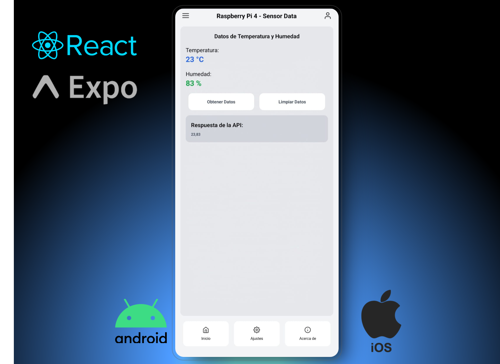

# Sensores App

## Descripción

Esta aplicación móvil permite visualizar datos de temperatura y humedad obtenidos de un sensor conectado a un Raspberry Pi 4. La aplicación está desarrollada con React Native y Expo, y utiliza TailwindCSS para el diseño de la interfaz de usuario.

## Stack Tecnológico

- **React Native**: Framework para el desarrollo de aplicaciones móviles.
- **Expo**: Plataforma para el desarrollo y construcción de aplicaciones React Native.
- **TailwindCSS**: Framework de CSS para el diseño de la interfaz de usuario.
- **React Native Vector Icons**: Biblioteca de iconos para React Native.

## Dependencias

- **@expo/metro-runtime**: Herramientas de tiempo de ejecución para aplicaciones Expo.
- **expo**: SDK de Expo para el desarrollo de aplicaciones React Native.
- **expo-status-bar**: Componente de barra de estado para aplicaciones Expo.
- **nativewind**: Integración de TailwindCSS con React Native.
- **react**: Biblioteca de JavaScript para construir interfaces de usuario.
- **react-dom**: Paquete para trabajar con el DOM en aplicaciones React.
- **react-native**: Framework para construir aplicaciones móviles nativas.
- **react-native-video**: Componente para reproducir videos en aplicaciones React Native.
- **react-native-web**: Herramientas para ejecutar aplicaciones React Native en la web.
- **expo-av**: Biblioteca de Expo para trabajar con audio y video.
- **expo-video**: Componente de video para aplicaciones Expo.

## Instalación

1. Clona este repositorio:
    ```sh
    git clone https://github.com/Ezzz-Lui/AppMobile-RaspberryPi.git
    cd sensores-app
    ```

2. Instala Expo CLI globalmente si no lo tienes instalado:
    ```sh
    npm install -g expo-cli
    ```

3. Instala las dependencias del proyecto:
    ```sh
    npm install
    ```

4. Inicia la aplicación:
    ```sh
    npm start
    ```

## Uso

1. Asegúrate de que tu dispositivo móvil y tu computadora estén en la misma red.
2. Inicia la aplicación en tu dispositivo móvil utilizando la aplicación Expo Go.
3. La aplicación mostrará los datos de temperatura y humedad obtenidos del sensor.

## Configuración

- La URL de la API se puede configurar en el archivo [`App.js`](../../../../../c:/Users/ProBook/Desktop/mobileApp-Sensores/App.js) en la constante `API_URL`.

## Scripts Disponibles

- `npm start`: Inicia el servidor de desarrollo de Expo.
- `npm run android`: Inicia la aplicación en un dispositivo Android.
- `npm run ios`: Inicia la aplicación en un dispositivo iOS.
- `npm run web`: Inicia la aplicación en un navegador web.

## Estructura del Proyecto

- `App.js`: Componente principal de la aplicación.
- `index.js`: Punto de entrada de la aplicación.
- `assets/`: Directorio que contiene los recursos estáticos como imágenes e iconos.
- `babel.config.js`: Configuración de Babel.
- `tailwind.config.js`: Configuración de TailwindCSS.
- `eas.json`: Configuración de EAS (Expo Application Services).

## Contribuciones

Las contribuciones son bienvenidas. Por favor, abre un issue o envía un pull request para discutir cualquier cambio que desees realizar.

## Licencia

Este proyecto está bajo la Licencia MIT. Consulta el archivo [LICENSE](LICENSE) para más detalles.